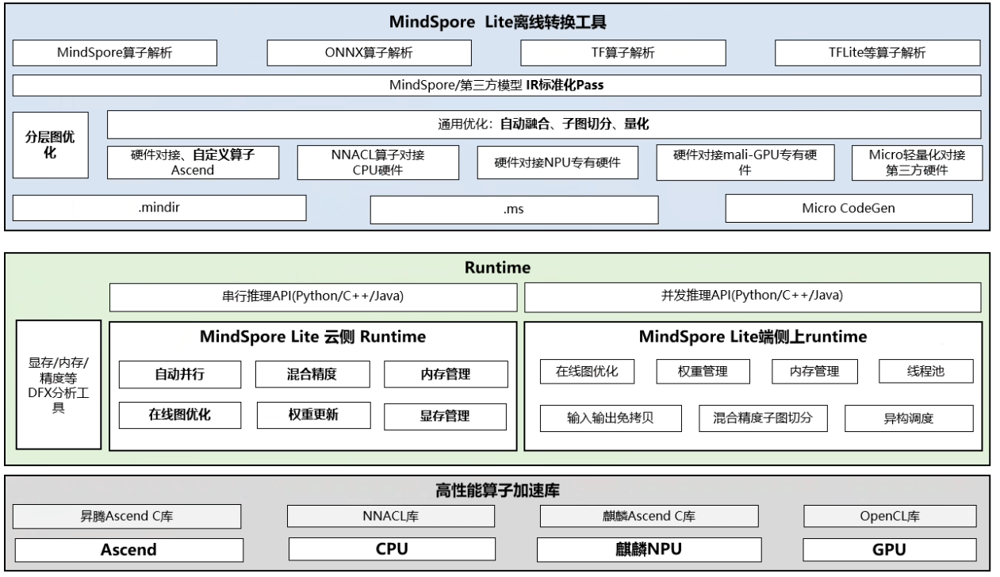

[查看中文](./README_CN.md)

## What Is MindSpore Lite

MindSpore Lite provides lightweight AI inference acceleration capabilities for different hardware devices, enabling intelligent applications and providing end-to-end solutions for developers. It offers development friendly, efficient, and flexible deployment experiences for algorithm engineers and data scientists, helping the AI software and hardware application ecosystem thrive. In the future, MindSpore Lite will work with the MindSpore AI community to enrich the AI software and hardware application ecosystem.

For more details please check out our [MindSpore Lite Architecture Guide](https://www.mindspore.cn/lite/docs/en/master/reference/architecture_lite.html).

### MindSpore Lite features

1. Terminal and Cloud one-stop inference deployment
   - Provide end-to-end processes for model transformation optimization, deployment, and inference.
   - The unified IR realizes the device-cloud AI application integration.

2. Lightweight
   - Provides model compress, which could help to improve performance as well.
   - Provides the ultra-lightweight reasoning solution MindSpore Lite Micro to meet the deployment requirements in extreme environments such as smart watches and headphones.

3. High-performance
   - The built-in high-performance kernel computing library NNACL supports high-performance inference for dedicated chips such as CPU, NNRt, and Ascend, maximizing hardware computing power while minimizing inference latency and power consumption.
   - Assembly code to improve performance of kernel operators. Supports CPU, GPU, and NPU.

4. Versatility
   - Support deployment of multiple hardware such as server-side Ascend and CPU.
   - Supports HarmonyOS and Android mobile operating systems.

## MindSpore Lite AI deployment procedure

1. Model selection and personalized training

   Select a new model or use an existing model for incremental training using labeled data. When designing a model for mobile device, it is necessary to consider the model size, accuracy and calculation amount.

   The MindSpore Lite team provides a series of pre-training models used for image classification, object detection. You can use these pre-trained models in your application.

   The pre-trained model provided by MindSpore: [Image Classification](https://download.mindspore.cn/model_zoo/official/lite/). More models will be provided in the feature.

   MindSpore allows you to retrain pre-trained models to perform other tasks.

2. Model converter and optimization

   If you use MindSpore or a third-party model, you need to use [MindSpore Lite Model Converter Tool](https://www.mindspore.cn/lite/docs/en/master/converter/converter_tool.html) to convert the model into MindSpore Lite model. The MindSpore Lite model converter tool provides the converter of TensorFlow Lite, Caffe, ONNX to MindSpore Lite model, fusion and quantization could be introduced during convert procedure.

   MindSpore Lite also provides a tool to convert models running on IoT devices .

3. Model deployment

   This stage mainly realizes model deployment, including model management, deployment, operation and maintenance monitoring, etc.

4. Inference

   Load the model and perform inference. [Inference](https://www.mindspore.cn/lite/docs/en/master/infer/runtime_cpp.html) is the process of running input data through the model to get output.

   MindSpore Lite provides pre-trained model that can be deployed on mobile device [example](https://www.mindspore.cn/lite/examples/en).
