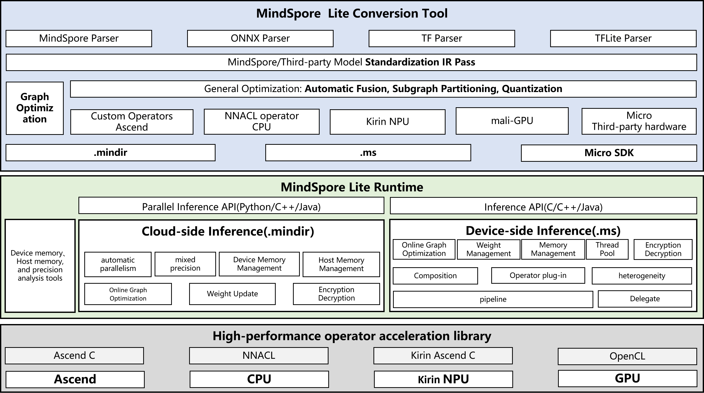

[查看中文](./README_CN.md)

## What Is MindSpore Lite

MindSpore Lite provides lightweight AI inference acceleration capabilities for different hardware devices, enabling intelligent applications and providing end-to-end solutions for developers. It offers development friendly, efficient, and flexible deployment experiences for algorithm engineers and data scientists, helping the AI software and hardware application ecosystem thrive. In the future, MindSpore Lite will work with the MindSpore AI community to enrich the AI software and hardware application ecosystem.

## Example

MindSpore Lite achieves double the inference performance for AIGC, speech algorithms, and CV model inference, and has been deployed in Huawei's flagship smartphones for commercial use. As shown in the figure below, MindSpore Lite supports image style transfer and image segmentation for CV algorithms.

  

   

## Quick Start

1. Compile

    MindSpore Lite has multiple different hardware backends, including:

    - For service side devices, users can compile dynamic libraries and Python wheel packages by setting compilation options such as `MSLITE_ENABLE_CLOUD_INFERENCE` for inference of upgrade and CPU hardware. For detailed compilation tutorials, please refer to [the official website of MindSpore Lite](https://www.mindspore.cn/lite/cloud_docs/en/master/use/build.html).

    - For end and edge devices, different dynamic libraries can be compiled through different cross compilation toolchains. For detailed compilation tutorials, please refer to [the official website of MindSpore Lite](https://www.mindspore.cn/lite/docs/en/master/use/build.html).

2. Model conversion

    MindSpore Lite supports the conversion of models serialized from various AI frameworks such as MindSpore, ONNX, TF, etc. into MindSpore Lite format IR. In order to achieve more efficient model inference, MindSpore Lite supports the conversion of models into `.ms` format or `.mindir` format, where:

    - The `.mindir` model is used for inference on service side devices and is more compatible with the model structure exported by the MindSpore training framework. It is mainly suitable for Ascend cards and X86/Arm architecture CPU hardware. For detailed conversion methods, please refer to [the Conversion Tool Tutorial](https://www.mindspore.cn/lite/cloud_docs/en/master/mindir/converter_tool.html).

    - The `.ms` model is mainly used for inference of end and edge devices, and is mainly suitable for terminal hardware such as Kirin NPU and Arm architecture CPU. In order to better reduce the size of the model file, the `.ms` model is serialized and deserialized through protobuffer. For detailed instructions on how to use the conversion tool, please refer to [the Conversion Tool](https://www.mindspore.cn/lite/docs/en/master/converter/converter_tool.html)

3. Model inference

    MindSpore Lite provides three APIs: Python, C++, and Java, and complete usage cases for the corresponding APIs:

    - Python API Interface Use Case

        [`.mindir` Reasoning Case Based on Python Interface](https://www.mindspore.cn/lite/cloud_docs/en/master/mindir/runtime_python.html)

    - C/C++ Complete Use Cases

        [`.mindir` model based on C/C++ Interface Inference Use Case](https://www.mindspore.cn/lite/cloud_docs/en/master/mindir/runtime_cpp.html)

        [`.ms` Model Based on C/C++ Interface Reasoning Case](https://developer.huawei.com/consumer/en/doc/harmonyos-guides/mindspore-guidelines-based-native)

    - Complete Java Use Cases

        [`.mindir` model based on Java interface inference use case](https://www.mindspore.cn/lite/cloud_docs/en/master/mindir/runtime_java.html)

## Technical Solution

### MindSpore Lite Features

1. Device and Cloud one-stop inference deployment

    - Provide end-to-end workflow for model transformation optimization, deployment, and inference.

    - The unified IR realizes the device-cloud AI application integration.

2. Lightweight

    - Provides model compression, which could help to improve performance.

    - Provides the ultra-lightweight inference solution - MindSpore Lite Micro, to meet the deployment requirements in extreme environments such as smart watches and headphones.

3. High-performance

    - The built-in kernel computing library NNACL supports high-performance inference for dedicated chips such as CPU, NNRt, and Ascend, maximizing hardware computing power while minimizing inference latency and power consumption.

    - Use assembly instructions to improve performance of kernels.

4. Versatility

    - Supports deployment of multiple hardware such as server-side Ascend and CPU.

    - Supports HarmonyOS and Android mobile operating systems.

## Further Understanding of MindSpore Lite

If you wish to further learn and use MindSpore Lite, please refer to the following content:

### API and documentation

1. API documentation:

    - [C++ API documentation](https://www.mindspore.cn/lite/api/en/master/api_cpp/mindspore.html)

    - [Java API documentation](https://www.mindspore.cn/lite/api/en/master/api_java/class_list.html)

    - [Python API documentation](https://www.mindspore.cn/lite/api/en/master/mindspore_lite.html)

    - [HarmonyOS API Document](https://developer.huawei.com/consumer/en/doc/harmonyos-references/development-intro-api)

2. [MindSpore Lite Official Website Document](https://www.mindspore.cn/lite/docs/en/master/index.html)

### Key characteristic capability

- [Support Ascend hardware inference](https://www.mindspore.cn/lite/cloud_docs/en/master/mindir/runtime_python.html)

- [Supporting HarmonyOS](https://developer.huawei.com/consumer/cn/sdk/mindspore-lite-kit)

- [Quantification after Training](https://www.mindspore.cn/lite/docs/en/master/advanced/quantization.html)

- [Lightweight Micro inference deployment](https://www.mindspore.cn/lite/docs/en/master/advanced/micro.html#%20Model%20inference%20code%20generation)

- [Benchmark Debugging Tool](https://www.mindspore.cn/lite/docs/en/master/tools/benchmark.html)

## Communication and Feedback

- Welcome to [Gitee Issues](https://gitee.com/mindspore/mindspore-lite/issues): submit questions, reports, and suggestions;

- Welcome to [Community Forum](https://discuss.mindspore.cn/c/mindspore-lite/38): engage in technical and problem-solving exchanges;

- Welcome to [Sig](https://www.mindspore.cn/sig/MindSpore%20Lite): to manage and improve workflow, participate in discussions and exchanges;

## Surrounding communities

- [MindSpore](https://gitee.com/mindspore/mindspore)

- [MindOne](https://github.com/mindspore-lab/mindone)

- [Mindyolo](https://github.com/mindspore-lab/mindyolo)

- [OpenHarmony](https://gitcode.com/openharmony/third_party_mindspore)
