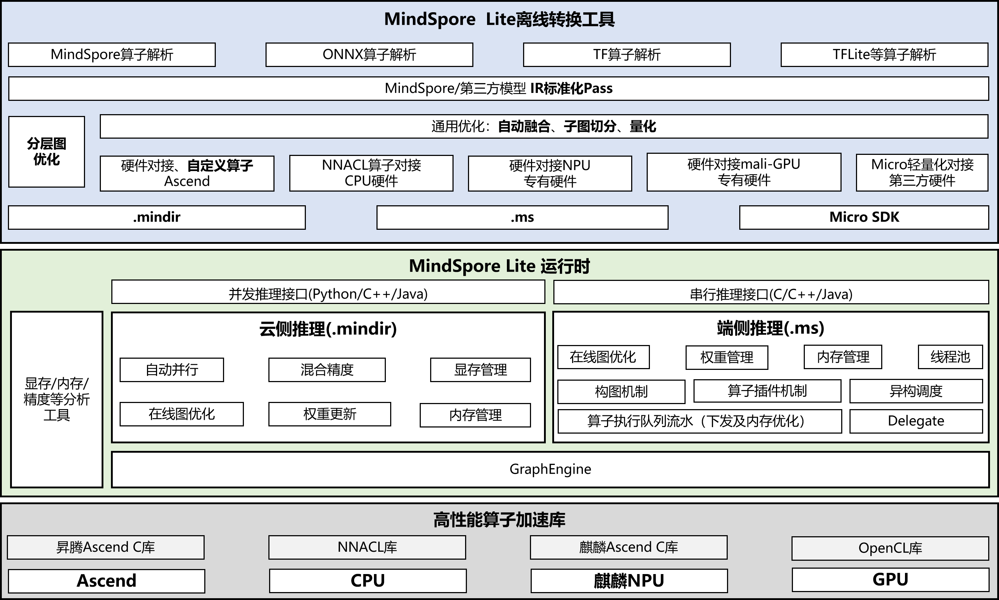


[View English](./README.md)

## MindSpore Lite简介

MindSpore Lite面向不同硬件设备提供轻量化AI推理加速能力，使能智能应用，为开发者提供端到端的解决方案，为算法工程师和数据科学家提供开发友好、运行高效、部署灵活的体验，帮助人工智能软硬件应用生态繁荣发展，未来MindSpore Lite将与MindSpore AI社区一起，致力于丰富AI软硬件应用生态。

## 效果示例

MindSpore Lite针对AIGC、语音类算法以及CV类模型推理，实现推理性能倍增，在华为多款旗舰手机落地商用落地。如下图所示，MindSpore Lite支持CV算法的图像风格迁移与图像分割。

  

   

## 快速入门

1. 编译

    MindSpore Lite支持多种不同的硬件后端，其中：

    - 针对服务侧设备，用户可以通过设置`MSLITE_ENABLE_CLOUD_INFERENCE`等编译选项，编译出动态库以及Python wheel包，用于昇腾、CPU硬件的推理，详细编译教程，可以参考[MindSpore Lite官网](https://www.mindspore.cn/lite/cloud_docs/zh-CN/master/use/build.html)。

    - 针对端、边设备，可以通过不同的交叉编译工具链编译出不同的动态库，详细编译教程，可以参考[MindSpore Lite官网](https://www.mindspore.cn/lite/docs/zh-CN/master/use/build.html)。

2. 模型转换

    MindSpore Lite支持将MindSpore、ONNX、TF等多种AI框架序列化出的模型转换成MindSpore Lite格式的IR，为了更高效地实现模型推理，MindSpore Lite支持将模型转换成`.mindir`格式或`.ms`格式，其中：

    - `.mindir`模型：用于服务侧设备的推理，可以更好地兼容MindSpore训练框架导出的模型结构，主要适用于昇腾卡，以及X86/Arm架构的CPU硬件，详细的转换方法可以参考[转换工具教程](https://www.mindspore.cn/lite/cloud_docs/zh-CN/master/mindir/converter_tool.html)。

    - `.ms`模型：主要用于端、边设备的推理，主要适用于麒麟NPU、Arm架构CPU等终端硬件。为了更好地降低模型文件大小，`.ms`的模型通过flatbuffers进行序列化与反序列化，详细的转换工具使用方式可以参考[转换教程](https://www.mindspore.cn/lite/docs/zh-CN/master/converter/converter_tool.html)。

3. 模型推理

    MindSpore Lite提供了Python、C++、Java三种API，并提供了对应API的完整使用用例：

    - Python API接口用例

        [`.mindir`基于Python接口推理用例](https://www.mindspore.cn/lite/cloud_docs/zh-CN/master/mindir/runtime_python.html)

    - C/C++完整用例

        [`.mindir`模型基于C/C++接口推理用例](https://www.mindspore.cn/lite/cloud_docs/zh-CN/master/mindir/runtime_cpp.html)

        [`.ms`模型基于C/C++接口推理用例](https://developer.huawei.com/consumer/cn/doc/harmonyos-guides/mindspore-guidelines-based-native)

    - Java完整用例

        [`.mindir`模型基于Java接口推理用例](https://www.mindspore.cn/lite/cloud_docs/zh-CN/master/mindir/runtime_java.html)

## 技术方案

### MindSpore Lite技术特点

1. 端云一站式推理部署

    - 提供模型转换优化、部署和推理端到端流程。

    - 统一的IR实现端云AI应用一体化。

2. 超轻量

    - 支持模型量化压缩，模型更小跑得更快。

    - 提供超轻量的推理解决方案MindSpore Lite Micro，满足智能手表、耳机等极限环境下的部署要求。

3. 高性能推理

    - 自带的高性能内核计算库NNACL，支持`CPU`、`NNRt`、`Ascend`等专用芯片高性能推理，最大化发挥硬件算力，最小化推理时延和功耗。

    - 汇编级优化，支持`CPU`、`GPU`、`NPU`异构调度，最大化发挥硬件算力，最小化推理时延和功耗。

4. 广覆盖

    - 支持服务端`Ascend`、`CPU`等多硬件部署。

    - 支持`鸿蒙`、`Android`手机操作系统。

## 进一步了解MindSpore Lite

如果您想要进一步学习和使用 MindSpore Lite，可以参考以下内容：

### API与文档

1. API文档：

    - [C++ API文档](https://www.mindspore.cn/lite/api/zh-CN/master/api_cpp/mindspore.html)

    - [Java API文档](https://www.mindspore.cn/lite/api/zh-CN/master/api_java/class_list.html)

    - [Python API文档](https://www.mindspore.cn/lite/api/zh-CN/master/mindspore_lite.html)

    - [鸿蒙API文档](https://developer.huawei.com/consumer/cn/doc/harmonyos-references/capi-mindspore)

2. [MindSpore Lite官网文档](https://www.mindspore.cn/lite/docs/zh-CN/master/index.html)

### 关键特性能力

- [支持昇腾硬件推理](https://www.mindspore.cn/lite/cloud_docs/zh-CN/master/mindir/runtime_python.html)

- [支持鸿蒙](https://developer.huawei.com/consumer/cn/sdk/mindspore-lite-kit)

- [训练后量化](https://www.mindspore.cn/lite/docs/zh-CN/master/advanced/quantization.html)

- [轻量化Micro推理部署](https://www.mindspore.cn/lite/docs/zh-CN/master/advanced/micro.html#模型推理代码生成)

- [基准调试工具](https://www.mindspore.cn/lite/docs/zh-CN/master/tools/benchmark.html)

## 交流与反馈

- 欢迎您通过[Gitee Issues](https://gitee.com/mindspore/mindspore-lite/issues)来提交问题、报告与建议。

- 欢迎您通过[社区论坛](https://discuss.mindspore.cn/c/mindspore-lite/38)进行技术、问题交流。

- 欢迎您通过[Sig](https://www.mindspore.cn/sig/MindSpore%20Lite)来管理和改善工作流程，参与讨论交流。

## 周边社区

- [MindSpore](https://gitee.com/mindspore/mindspore)

- [MindOne](https://github.com/mindspore-lab/mindone)

- [Mindyolo](https://github.com/mindspore-lab/mindyolo)

- [OpenHarmony](https://gitcode.com/openharmony/third_party_mindspore)
